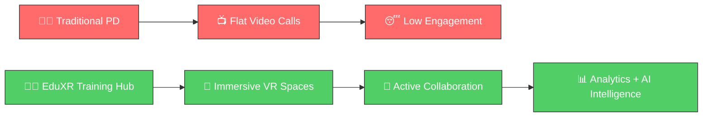
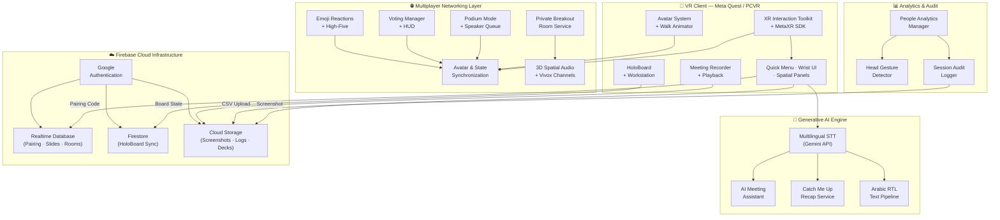
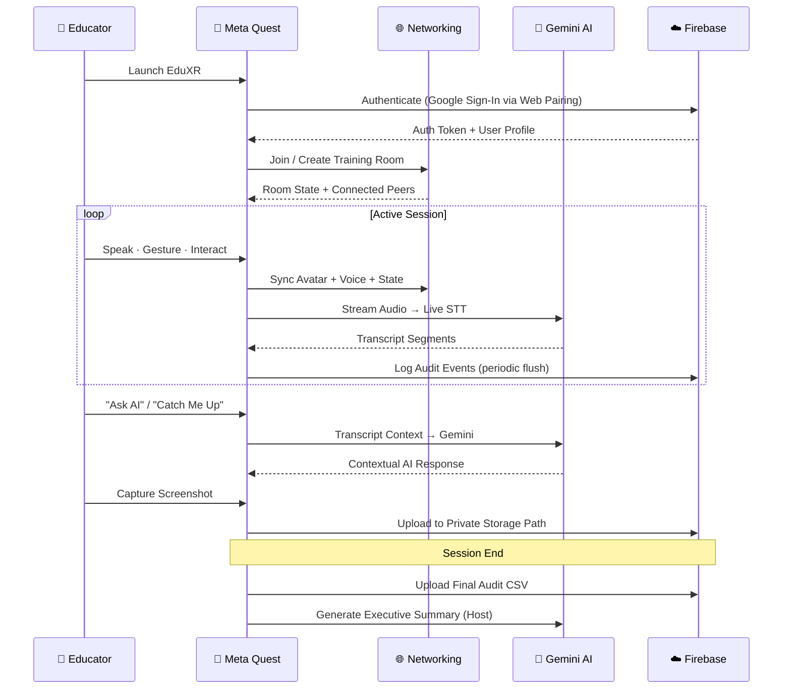
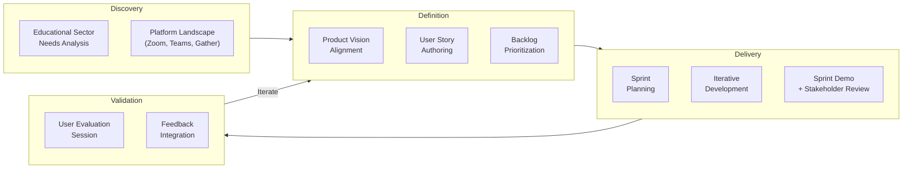
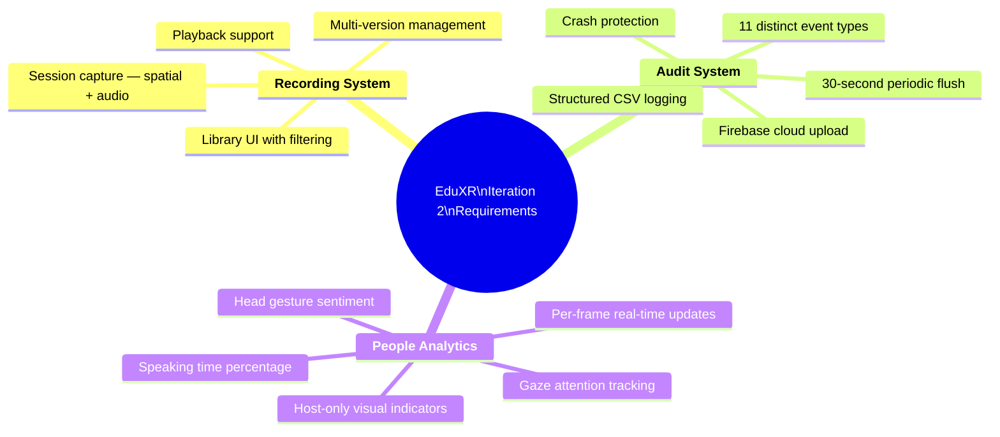
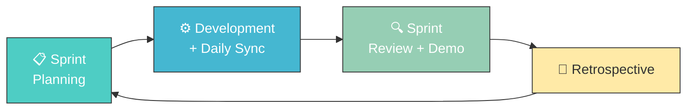

<p align="center">
  
</p>

<h1 align="center">EduXR Training Hub</h1>

<p align="center">
  <em>Immersive XR Platform for Educational Staff Professional Development & Collaboration</em>
</p>

<p align="center">
  <a href="https://unity.com/"></a>
  <a href="https://www.meta.com/quest/"></a>
  <a href="https://firebase.google.com/"></a>
  <a href="https://deepmind.google/technologies/gemini/"></a>
  
  
</p>

<p align="center">
  
  
  
  
  
</p>

---

## Table of Contents

- [Executive Summary](#executive-summary)
- [Why This Project Matters](#why-this-project-matters)
- [Problem Statement](#problem-statement)
- [Solution Overview](#solution-overview)
- [Key Features](#key-features)
- [Feature Matrix](#feature-matrix)
- [System Architecture](#system-architecture)
- [Technology Stack](#technology-stack)
- [Core Engineering Components](#core-engineering-components)
- [Product Management Approach](#product-management-approach)
- [Requirements Engineering Process](#requirements-engineering-process)
- [Agile Development Lifecycle](#agile-development-lifecycle)
- [My Role & Contributions](#my-role--contributions)
- [Technical Challenges & Solutions](#technical-challenges--solutions)
- [Stakeholder Validation](#stakeholder-validation)
- [Project Demonstrations](#project-demonstrations)
- [Installation](#installation)
- [Project Structure](#project-structure)
- [Future Roadmap](#future-roadmap)
- [Acknowledgements](#acknowledgements)
- [Contact](#contact)

---

## Executive Summary

**EduXR Training Hub** is a production-oriented, immersive XR platform built to transform how educational institutions conduct professional development, staff meetings, and collaborative training.

The platform replaces flat video conferencing — where educators passively watch shared screens — with **shared 3D virtual environments** where participants interact as avatars, collaborate on holographic whiteboards, engage in structured governance sessions, and benefit from real-time AI-powered meeting intelligence.

Developed by a team of 4 software engineers following Agile methodology, the system integrates:

- **Real-time multiplayer networking** with avatar synchronization and spatial audio
- **Generative AI** (Google Gemini) for live multilingual transcription and contextual meeting intelligence
- **Cloud infrastructure** (Firebase Auth, Realtime Database, Firestore, Cloud Storage) for state synchronization and persistence
- **Behavioral analytics** — speaking time, gaze attention, and sentiment detection — visible to session hosts in real time

The project received a final grade of **99/100**, the **highest among all Software Engineering graduation projects** in the cohort.

> **This repository demonstrates competencies in:** distributed systems architecture, real-time networking, XR interaction design, cloud-native backend integration, AI service integration, product ownership, requirements engineering, and Agile delivery.

---

## Why This Project Matters

The global shift toward remote and hybrid work has exposed deep limitations in traditional video conferencing — particularly in fields that depend on **active participation, spatial collaboration, and nuanced interpersonal interaction**.

Education is one of the hardest-hit domains. Professional development sessions — workshops, committee reviews, mentoring programs, collaborative curriculum design — require the kind of engagement that a grid of webcam tiles cannot provide.

EduXR Training Hub was built to close that gap: not as a theoretical prototype, but as a **working, multi-user, cloud-connected VR platform** tested with real educational stakeholders.

**What makes this project distinctive:**

| Dimension | What It Demonstrates |
|:---|:---|
| **Engineering depth** | 70+ C# scripts across networking, AI, analytics, recording, and cloud subsystems |
| **Systems thinking** | End-to-end architecture spanning VR client → networking layer → AI services → cloud persistence |
| **Product maturity** | Real user validation with education-sector stakeholders, not theoretical use cases |
| **AI integration** | Production-grade Gemini API pipeline: live STT, contextual Q&A, session summaries, RTL Arabic support |
| **Agile execution** | Two full iterations with distinct client-defined requirement pillars and sprint-based delivery |

---

## Problem Statement

Educational institutions rely heavily on platforms like Zoom and Microsoft Teams for professional development. These tools, while functional for basic communication, create systemic problems for training and collaboration:

| Problem | Consequence |
|:---|:---|
| **Passive participation** | Educators join meetings with cameras off; engagement drops over time |
| **No spatial presence** | Participants feel isolated — no sense of being "in the room together" |
| **Limited collaboration surfaces** | Screen sharing is sequential; real-time co-creation is constrained |
| **No behavioral visibility** | Hosts cannot observe attention, sentiment, or participation levels |
| **Meeting fatigue** | Back-to-back flat video sessions erode focus and motivation |
| **Poor training transfer** | Abstract slide-based workshops fail to simulate real professional scenarios |

These problems are not superficial UX issues — they directly reduce the effectiveness of professional development programs that educational institutions invest significant resources in.

---

## Solution Overview

EduXR Training Hub reimagines professional development as a **spatial, collaborative, AI-assisted experience**:



**How it works:**

1. Educators launch the app on Meta Quest and authenticate via web-based Google Sign-In
2. They join or create a training room and appear as customizable avatars in a shared 3D environment
3. A host can present slides (synced from Google Drive via Firebase), activate Podium Mode for structured lectures, or open HoloBoard for collaborative whiteboarding
4. AI transcribes speech in real time across English, Arabic, and Hebrew — late joiners can request an instant "Catch Me Up" summary
5. The host sees live analytics on each participant's name tag: speaking time percentage, gaze attention, and sentiment (nod/shake detection)
6. Breakout rooms provide fully isolated sub-spaces for small-group work
7. Session recordings, audit logs, and personal screenshots persist in Firebase Cloud Storage

---

## Key Features

### AI-Powered Meeting Intelligence
- **Live multilingual transcription** — Real-time STT in English, Arabic (full RTL support), and Hebrew, powered by Google Gemini
- **"Ask AI" contextual assistant** — Host queries the meeting transcript for action items, decisions, or free-form questions
- **"Catch Me Up" late-joiner recap** — One-tap AI-generated summary of missed discussion for latecomers
- **Host executive summaries** — On-demand session summaries generated at meeting close

### Real-Time Multiplayer Collaboration
- **Avatar synchronization** — Low-latency body tracking, gesture sync, and walk animation
- **3D spatial audio** — Positional audio relative to avatar distance and room boundaries
- **Isolated breakout rooms** — Private sub-rooms (up to 4 participants) with complete audio, visual, and drawing isolation
- **Networked emoji reactions** — Spam-throttled 3D animated emojis floating above avatars
- **High-five interactions** — Networked gesture detection with haptic feedback

### Productivity & Collaboration Tools
- **HoloBoard holographic whiteboard** — Networked surface painting, interactive sticky notes, throwable graph nodes, Firestore-synced state
- **VR workstation** — Virtual floating screens, window management, optical magnifier for inspecting documents
- **Dynamic slide sync** — Presentation decks synced from Google Drive through Firebase in real time
- **Voting system** — In-session polls with real-time HUD display and layout utilities

### Session Governance
- **Podium mode** — Host-controlled room governance: seat all participants, mute everyone, manage a hand-raising speaker queue
- **People analytics** — Real-time speaking time %, gaze tracking, and head-gesture sentiment visible on each participant's name tag (host-only)
- **Session audit logging** — 11 distinct event types logged to structured CSV with periodic flush and Firebase upload
- **Session timers** — Agenda timers, meeting duration, and eco-efficiency progress indicators

### Cloud & Authentication
- **Web pairing authentication** — Browser-based headset-to-Google-account linking flow
- **Personal cloud snapshots** — Wrist-button or controller-triggered screenshots uploaded to private Firebase Storage paths
- **Session recording & playback** — Spatial data capture (head, hands) with audio, multi-version management, and library browser

---

## Feature Matrix

| Feature | Multi-User | Cloud Synced | AI-Powered | Host-Only | Status |
|:---|:---:|:---:|:---:|:---:|:---|
| Live Transcription (EN/AR/HE) | ✅ | ✅ | ✅ | — | Implemented |
| AI Meeting Assistant ("Ask AI") | — | — | ✅ | ✅ | Implemented |
| Late-Joiner Recap ("Catch Me Up") | ✅ | — | ✅ | — | Implemented |
| Avatar Synchronization | ✅ | — | — | — | Implemented |
| Spatial Audio | ✅ | — | — | — | Implemented |
| Private Breakout Rooms | ✅ | — | — | — | Implemented |
| HoloBoard Whiteboard | ✅ | ✅ | — | — | Implemented |
| Slide Presentation Sync | ✅ | ✅ | — | — | Implemented |
| Podium Mode | ✅ | — | — | ✅ | Implemented |
| Voting System | ✅ | — | — | ✅ | Implemented |
| People Analytics | ✅ | — | — | ✅ | Implemented |
| Session Audit Logging | — | ✅ | — | ✅ | Implemented |
| Session Recording | ✅ | — | — | ✅ | Implemented |
| Personal Cloud Snapshots | — | ✅ | — | — | Implemented |
| Web Pairing Auth | — | ✅ | — | — | Implemented |
| Emoji Reactions | ✅ | — | — | — | Implemented |
| High-Five Gestures | ✅ | — | — | — | Implemented |
| Session Timers | ✅ | — | — | — | Implemented |
| Room Music | ✅ | — | — | — | Implemented |

---

## System Architecture

### High-Level Component Architecture



### Runtime Interaction Sequence



---

## Technology Stack

| Layer | Technology | Role in System |
|:---|:---|:---|
| **Runtime** | Unity 2022.3 LTS | Core engine, URP rendering, scene management |
| **Language** | C# | All application logic, networking, and services |
| **XR Framework** | XR Interaction Toolkit | Cross-platform input, hand tracking, locomotion |
| **VR Hardware** | Meta Quest 2 / 3 / Pro | Primary deployment target |
| **Meta SDK** | MetaXR SDK | Quest-native features, HorizonOS UI integration |
| **Networking** | Unity Netcode for GameObjects | Real-time state replication, RPCs, network variables |
| **Voice** | Vivox | Spatial audio, voice channels, breakout isolation |
| **AI** | Google Gemini API | Speech-to-text, summaries, contextual Q&A |
| **Auth** | Firebase Authentication | Google Sign-In, headset pairing flow |
| **Database** | Firebase Realtime Database | Device pairing, slide sync, room state |
| **Document Store** | Cloud Firestore | HoloBoard state synchronization |
| **Object Storage** | Firebase Cloud Storage | Screenshots, audit logs, presentations |
| **Drive** | Google Drive API | Slide deck import and live sync |
| **Geospatial** | Cesium 3D Tiles | Urban environment rendering |
| **Text** | TextMesh Pro | VR UI rendering, RTL text, rich formatting |
| **Build** | Android / Windows | Quest standalone + PCVR deployment |

---

## Core Engineering Components

### 1. HoloBoard — Real-Time Collaborative Whiteboard
> `Assets/Scripts/HoloBoard/`

The HoloBoard is a networked holographic whiteboard enabling multi-user collaboration in VR:

| File | Lines | Responsibility |
|:---|:---:|:---|
| `HoloBoardManager.cs` | ~2,100 | Core controller: drawing surfaces, note placement, graph interactions |
| `FirestoreHoloBoardSync.cs` | ~150 | Cloud synchronization of board state via Firestore |
| `StickyNoteTab.cs` | ~370 | Interactive sticky note system with VR grab-and-place |
| `ThrowableGraphNode.cs` | ~170 | Physics-enabled graph nodes for spatial brainstorming |
| `TrashCanTrigger.cs` | ~230 | Physics-based deletion — throw objects into a trash can |
| `NetworkedSurfacePainter.cs` | ~85 | Networked ink strokes synced across participants |
| `WristHoloBoardButton.cs` | ~210 | Quick-access wrist UI toggle |

**Engineering highlights:** Firestore-backed persistence across sessions, real-time multi-user ink synchronization, physics-driven deletion UX.

---

### 2. AI Transcription & Meeting Intelligence
> `Assets/VRMPAssets/Scripts/Transcription/`

End-to-end pipeline from audio capture to AI-generated meeting intelligence:

| File | Lines | Responsibility |
|:---|:---:|:---|
| `TranscriptionSystem.cs` | ~1,500 | Core pipeline: audio capture, Gemini API communication, transcript management |
| `GeminiService.cs` | ~900 | Google Gemini API client: STT requests, AI completions, error handling |
| `AIMeetingAssistant.cs` | ~260 | "Ask AI" host feature: contextual queries against transcript |
| `CatchMeUpService.cs` | ~270 | Late-joiner recap generation |
| `TranscriptionManager.cs` | ~700 | Transcript lifecycle and session coordination |
| `ArabicFixer.cs` | ~260 | Arabic text shaping and ligature correction |
| `RtlTextUtility.cs` | ~250 | RTL layout algorithm for Arabic/Hebrew text in Unity |
| `RTLFontHelper.cs` | ~75 | Font asset selection for RTL rendering |
| `TranscriptPanel.cs` | ~360 | UI display: StringBuilder-based accumulation, 50-line circular buffer, auto-scroll |
| `SummaryPanel.cs` | ~170 | Summary display panel |

**Engineering highlights:** Custom RTL text rendering pipeline for Arabic (not natively supported in Unity), quota-aware API design (host-only features), circular buffer transcript with TMP rich text formatting.

---

### 3. People Analytics & Behavioral Tracking
> `Assets/VRMPAssets/Scripts/Analytics/`

Real-time behavioral analytics displayed on participant name tags, visible to session hosts:

| File | Lines | Responsibility |
|:---|:---:|:---|
| `AnalyticsManager.cs` | ~742 | Speaking time %, gaze tracking, sentiment display, indicator generation |
| `HeadGestureDetector.cs` | ~493 | Nod/shake detection with noise filtering, peak/valley analysis, confidence scoring |
| `SessionAuditLogger.cs` | ~882 | 11-event-type CSV logging, periodic flush, Firebase upload |
| `PlayerAnalyticsData.cs` | ~39 | Network-serializable analytics struct |

**Tracked metrics:**

| Metric | Detection Method | Visual Indicator |
|:---|:---|:---|
| Speaking Time | `(SpeakingSeconds / SessionDuration) × 100%` | Color-coded: White (0–20%) · Green (20–50%) · Orange (50%+) |
| Gaze Attention | Head forward vector angle to target (30° threshold, debounced) | Green (focused) / Gray (distracted) eye icon |
| Sentiment | Head gesture analysis: rhythm, velocity, amplitude, confidence | Green (nod/agreement) · Red (shake/disagreement) · Yellow (neutral) |

**Audit event types (11):**
```
SESSION_START · SESSION_END · PLAYER_JOIN · PLAYER_LEAVE · MUTE_TOGGLE
ATTENTION_LAPSE · ATTENTION_RESTORED · SLIDE_CHANGE
SPEAKING_CONTRIBUTION · CONSENSUS_NOD · DISAGREEMENT_SHAKE
```

---

### 4. Private Breakout Rooms
> `Assets/VRMPAssets/Scripts/PrivateRoom/`

Fully isolated sub-rooms with independent audio, visual, and collaboration channels:

| File | Lines | Responsibility |
|:---|:---:|:---|
| `PrivateRoomService.cs` | ~1,300 | Room lifecycle, membership, isolation enforcement |
| `PrivateRoomUIController.cs` | ~1,080 | Room creation, invitation, and management UI |
| `PrivateRoomInviteService.cs` | ~250 | Invitation and acceptance flow |
| `PrivateRoomState.cs` | ~85 | Network-synchronized room state |
| `PrivateRoomPodiumCompatibility.cs` | ~75 | Integration between breakout rooms and podium governance |

---

### 5. Session Recording & Playback
> `Assets/Scripts/Recording/` + `Assets/VRMPAssets/Scripts/Recording/`

| File | Lines | Responsibility |
|:---|:---:|:---|
| `MeetingRecorder.cs` | ~514 | Spatial data capture (head, hands) at configurable FPS + audio |
| `RecordingDataManager.cs` | ~264 | Async file I/O for recordings |
| `RecordingsLibraryUI.cs` | ~360 | Library browser with category filtering |
| `RecordingVersionSelector.cs` | ~196 | Multi-version management with HorizonOS dropdown |
| `RecordingDataModels.cs` | ~144 | Data structures for versioned sessions |
| `RecordingPanel.cs` | ~310 | Recording controls UI |

---

### 6. Presentation & Cloud Sync
> `Assets/VRMPAssets/Scripts/Presentation/`

| File | Lines | Responsibility |
|:---|:---:|:---|
| `PresentationNetworkManager.cs` | ~780 | Networked slide synchronization |
| `FirebaseStorageManager.cs` | ~850 | Cloud file management (upload, download, security) |
| `FirestoreRoomSync.cs` | ~680 | Real-time room state via Firestore |
| `PresentationUIManager.cs` | ~870 | Full presentation control surface |
| `PresentationTVManager.cs` | ~300 | Virtual TV display rendering |

---

### 7. Session Governance — Podium Mode & Voting
> `Assets/VRMPAssets/Scripts/Gameplay/`

| File | Lines | Responsibility |
|:---|:---:|:---|
| `VotingManager.cs` | ~1,280 | Real-time polling, vote tallying, state replication |
| `VotingHUD.cs` | ~420 | In-VR vote display |
| `ChairManager.cs` | ~740 | Networked seating system with locomotion override |
| `SittableChair.cs` | ~455 | Individual chair interaction logic |
| `EmojiReactionNetwork.cs` | ~140 | Networked 3D emoji spawning |
| `HighFiveSnap.cs` + `HighFiveSnapNetwork.cs` | ~600 | Networked gesture + haptics |

---

### 8. VR UI System
> `Assets/VRMPAssets/Scripts/UI/`

12 distinct UI panels built on consistent architectural patterns:

- **Reactive subscription pattern** — Event-driven state updates with Subscribe/Unsubscribe lifecycle
- **Panel toggle array** — Array-based multi-panel switching
- **LOD system** — Player name tags scale detail by distance (3m max, 1m min threshold)
- **Spatial positioning** — Panels positioned relative to camera with pitch/roll zeroing
- **Network-aware design** — All panels handle connected/disconnected states
- **State machine architecture** — Lobby UI uses a 6-state machine (Lobby → Creation → Connection → Success/Failure/NoConnection)

---

## Product Management Approach

This project was not only an engineering effort — it was managed with deliberate product discipline:

### Product Thinking Framework



### Product decisions reflected in the codebase

| Decision | Rationale | Implementation |
|:---|:---|:---|
| Host-only AI features | Manage Gemini API costs without degrading experience | `AIMeetingAssistant`, `SummaryPanel` gated by `IsSessionOwner` |
| Podium Mode as governance | Educators needed structured lecture formats, not just open rooms | `ChairManager` seats + mutes all; hand-raise queue for speaking |
| Breakout room isolation | Small-group work requires complete separation from main hall | Full Vivox channel, visual, and ink isolation in `PrivateRoomService` |
| Arabic RTL support | Serving multilingual educational institutions | Custom `ArabicFixer` + `RtlTextUtility` pipeline |
| Periodic audit flush | Prevent data loss during VR sessions (headset battery, crashes) | 30-second `FlushToDisk()` interval in `SessionAuditLogger` |

---

## Requirements Engineering Process

### Iteration 2 — Three Requirement Pillars

Iteration 2 was structured around three distinct requirement pillars, each driven by a specific academic client:



### Requirements Traceability — User Stories to Code

| User Story | Implementing Component | Verification |
|:---|:---|:---|
| *"As a host, I can start/stop recording"* | `MeetingRecorder.StartRecording()` / `StopRecording()` | ✅ |
| *"As a user, I can browse recorded sessions"* | `RecordingsLibraryUI.LoadRecordings()` | ✅ |
| *"As a user, I can select a recording version"* | `RecordingVersionSelector.SelectVersion()` | ✅ |
| *"As the system, I log all significant events"* | `SessionAuditLogger` — 11 event types | ✅ |
| *"As the system, I upload audit logs to cloud"* | `SessionAuditLogger.UploadAuditLog()` → Firebase | ✅ |
| *"As the system, I prevent data loss"* | `FlushToDisk()` every 30 seconds | ✅ |
| *"As a host, I see speaking time %"* | `AnalyticsManager.UpdateSpeaking()` | ✅ |
| *"As a host, I see gaze attention"* | `AnalyticsManager.UpdateGaze()` | ✅ |
| *"As a host, I see sentiment (nod/shake)"* | `HeadGestureDetector.DetectGestures()` | ✅ |

---

## Agile Development Lifecycle

### Sprint Cadence



### Iteration Breakdown

| Iteration | Scope | Stakeholders | Key Deliverables |
|:---|:---|:---|:---|
| **Iteration 1** | Core VR Platform | Team-defined | Multi-user rooms, avatars, spatial audio, HoloBoard, presentations, AI transcription, breakout rooms, emoji reactions, podium mode |
| **Iteration 2** | Advanced Systems | Dr. Adnan Agbaria, Prof. Eran Carmel, Dr. Yael Livne | Recording system, audit logging (11 event types), people analytics (speaking, gaze, sentiment) |

### Agile Practices Applied

- **User story mapping** — Every feature traced to a specific stakeholder need
- **Sprint planning** — Prioritized backlog based on stakeholder impact and technical dependencies
- **Stakeholder demos** — Working features demonstrated to academic clients each sprint
- **Iterative delivery** — Functional increments delivered every sprint, not deferred to project end
- **Retrospectives** — Process improvements identified and applied between sprints

---

## My Role & Contributions

**Walaa Mruwat** — *Product Owner & Software Engineer*

I served a dual role on this project, combining product ownership with hands-on engineering contributions.

### Product Ownership

| Responsibility | Activities |
|:---|:---|
| **Product Vision** | Defined platform direction for educational staff professional development |
| **Requirements Analysis** | Gathered, analyzed, and documented requirements from academic stakeholders |
| **User Story Authoring** | Wrote user stories mapping features to specific educator needs and acceptance criteria |
| **Backlog Management** | Maintained and prioritized the product backlog across sprints |
| **Sprint Planning** | Collaborated on sprint planning, scope definition, and task breakdown |
| **Stakeholder Communication** | Facilitated feedback sessions with clients and faculty advisors |
| **User Validation** | Organized and conducted evaluation sessions with education-sector professionals |

### Engineering Contributions

| Responsibility | Activities |
|:---|:---|
| **Feature Development** | Contributed to implementation of platform features alongside the engineering team |
| **Avatar & Presence** | Defined and supported the Visual Presence user story and avatar interaction experience |
| **Visual Identity** | Requirements and implementation support for avatar customization and identity |
| **VR Testing** | Hands-on testing on Meta Quest hardware — identified UX friction points, input issues, and spatial interaction improvements |
| **Technical Problem Solving** | Participated in debugging sessions and cross-functional technical discussions |
| **Quality Assurance** | Systematic testing of features across devices and session configurations |

### Skills Demonstrated

```
Product Ownership          Requirements Engineering     User Story Mapping
Stakeholder Management     Sprint Planning              Backlog Prioritization
Product Vision Alignment   User Validation              Acceptance Criteria
Software Development       VR Usability Testing         Cross-functional Collaboration
Agile Methodology          Feature Prioritization       Technical Problem Solving
```

---

## Technical Challenges & Solutions

### Engineering Challenges

| Challenge | Root Cause | Solution |
|:---|:---|:---|
| **Breakout room audio isolation** | Vivox spatial audio doesn't natively support sub-room isolation | Implemented full channel switching with visual, audio, and ink separation in `PrivateRoomService.cs` (~1,300 lines) |
| **Arabic RTL text in Unity** | Unity / TextMesh Pro has no native RTL text support | Built a 3-file custom pipeline: `ArabicFixer.cs` (shaping), `RtlTextUtility.cs` (layout), `RTLFontHelper.cs` (font selection) |
| **Head gesture accuracy** | Naïve threshold detection produces false positives from normal head movement | Developed a multi-signal confidence scorer in `HeadGestureDetector.cs`: noise filtering, peak/valley detection, rhythm analysis, velocity + amplitude validation |
| **Real-time analytics at scale** | Per-frame metric calculation for every participant risks frame drops | Debounced attention tracking (1.0s lapse / 0.5s restore thresholds), efficient name tag LOD system (hide at <1m, minimize at >3m) |
| **Data loss during VR sessions** | Quest headsets can lose power or crash mid-session | 30-second periodic flush in `SessionAuditLogger.cs`, crash-resilient file management |
| **Cross-platform XR input** | Meta Quest, PCVR, and hand tracking require different input handling | XR Interaction Toolkit abstraction layer with platform-specific visual components via `NetworkedPlatformSpecificVisuals.cs` |
| **Transcript UI performance** | Unbounded transcript text causes TMP layout performance degradation | Circular buffer (50-line cap) with `StringBuilder`-based accumulation and forced canvas updates |
| **API cost management** | Unlimited Gemini API access for all participants would be cost-prohibitive | Architected host-only AI features: transcription, Ask AI, and summary generation gated by `IsSessionOwner` |

### Product & Process Lessons

- **Three distinct clients, three requirement pillars** — Forced rigorous separation of concerns and clear interfaces between subsystems
- **VR UX requires physical testing** — Usability issues only surface through actual headset testing; desktop simulation is insufficient
- **Iterative delivery builds stakeholder confidence** — Working demos each sprint built trust and enabled course corrections before they became expensive
- **Quota-aware architecture is a product decision** — Host-only AI features were a deliberate product/engineering co-decision to balance user experience with operational costs

---

## Stakeholder Validation

A formal evaluation session was conducted with a representative user from the educational sector.

### Validation Results

| Dimension | Assessment | Details |
|:---|:---:|:---|
| **Innovation** | ⭐ Positive | Recognized as an innovative approach to educational professional development |
| **Visual Realism** | ⭐ Positive | High-quality 3D environments and avatar fidelity |
| **Interaction Quality** | ⭐ Positive | Natural spatial interaction and avatar-based communication |
| **Collaboration** | ⭐ Positive | Effective multi-user collaboration experience |
| **Educational Value** | ⭐ Positive | Strong potential for professional development programs |

### Identified Improvement Areas

| Area | Planned Mitigation |
|:---|:---|
| Initial learning curve for VR-new users | Onboarding tutorial and guided first-run experience |
| Complex feature discoverability | In-app tooltips and contextual help |

### Academic Assessment

| Metric | Result |
|:---|:---|
| **Final Grade** | **99 / 100** |
| **Cohort Ranking** | **Highest grade** among all SE graduation projects |
| **Audit System** | Assessed as "Excellent" — fully differentiated event types with structured logging |
| **People Analytics** | Assessed as "Excellent" — multiple behavioral metrics with real-time calculation |
| **Recording System** | Assessed as "Complete" — spatial + audio capture with version management |

---

## Project Demonstrations

### Final Project Demonstration

A complete overview of EduXR Training Hub, showcasing the core platform capabilities, educational use cases, and collaborative XR environment.

[](https://youtu.be/GkPlSb10K4E)

▶️ [Watch the Final Demonstration](https://youtu.be/GkPlSb10K4E)

---

### VR Headset Demonstration

A first-person immersive experience recorded directly from the VR headset, demonstrating how educators interact within the platform — avatar movement, spatial collaboration, and XR interactions.

[](https://youtu.be/D-fzvkf6aRM)

▶️ [Watch the VR Headset Experience](https://youtu.be/D-fzvkf6aRM)

---

### Feature Walkthrough

Detailed demonstration of the platform's key features, workflows, and user interactions — including HoloBoard, AI transcription, podium mode, breakout rooms, and analytics.

[](https://youtu.be/EYQ8QPa6jno)

▶️ [Watch the Feature Walkthrough](https://youtu.be/EYQ8QPa6jno)

---

## Installation

### Prerequisites

| Requirement | Specification |
|:---|:---|
| **Unity** | 2022.3 LTS (Universal Render Pipeline) |
| **Hardware** | Meta Quest 2 / 3 / Pro, or PCVR headset (SteamVR / Oculus Link) |
| **Firebase** | Active project with Auth, Realtime Database, Firestore, Cloud Storage |
| **AI** | Valid Google Gemini API key |
| **Build** | Android Build Support module (for Quest standalone builds) |

### Setup

```bash
# 1. Clone
git clone https://github.com/WalaaMruwat/EduXR-Training-Hub.git
cd EduXR-Training-Hub

# 2. Open in Unity Hub → Add → Select project root → Unity 2022.3 LTS

# 3. Firebase: Place google-services.json in Assets/
#    Follow Firebase_Setup_Guide.md for security rules

# 4. Scene setup (Unity Editor menu bar):
#    VRMP → Setup AI Assistant + Reactions
#    VRMP → Setup Catch Me Up
#    VRMP → Setup Podium Mode

# 5. Build:
#    Quest Standalone → Switch to Android → Build and Run
#    PCVR → Build for Windows with OpenXR
```

> See [`Firebase_Setup_Guide.md`](Firebase_Setup_Guide.md) for detailed Realtime Database and Storage security rules.

---

## Project Structure

```
EduXR-Training-Hub/
├── Assets/
│   ├── Scripts/                              # Feature-specific systems
│   │   ├── HoloBoard/                        # Holographic whiteboard
│   │   │   ├── HoloBoardManager.cs           #   Core whiteboard controller
│   │   │   ├── FirestoreHoloBoardSync.cs     #   Cloud state sync
│   │   │   ├── StickyNoteTab.cs              #   Interactive sticky notes
│   │   │   ├── ThrowableGraphNode.cs         #   Physics graph nodes
│   │   │   ├── TrashCanTrigger.cs            #   Physics deletion
│   │   │   └── WristHoloBoardButton.cs       #   Wrist quick-access
│   │   ├── Recording/                        # Recording data layer
│   │   │   ├── RecordingDataManager.cs       #   Async file I/O
│   │   │   ├── RecordingDataModels.cs        #   Multi-version structs
│   │   │   ├── RecordingsLibraryUI.cs        #   Library browser
│   │   │   └── RecordingVersionSelector.cs   #   Version management
│   │   ├── VRMagnifier.cs                    # Optical magnifier tool
│   │   ├── VRWorkstationManager.cs           # Virtual floating screens
│   │   ├── SessionTimerManager.cs            # Agenda + duration timers
│   │   ├── MeetingAirQualityController.cs    # Environmental simulation
│   │   └── TrafficSpawner.cs                 # City traffic simulation
│   │
│   ├── VRMPAssets/                           # Core VR Multiplayer Platform
│   │   └── Scripts/
│   │       ├── Analytics/                    # People analytics + audit
│   │       │   ├── AnalyticsManager.cs       #   Speaking, gaze, sentiment
│   │       │   ├── HeadGestureDetector.cs    #   Nod/shake detection
│   │       │   ├── SessionAuditLogger.cs     #   11-event CSV logging
│   │       │   └── PlayerAnalyticsData.cs    #   Network-serializable data
│   │       ├── Transcription/                # AI + multilingual STT
│   │       │   ├── TranscriptionSystem.cs    #   Core STT pipeline
│   │       │   ├── GeminiService.cs          #   Gemini API client
│   │       │   ├── AIMeetingAssistant.cs     #   "Ask AI" feature
│   │       │   ├── CatchMeUpService.cs       #   Late-joiner recap
│   │       │   ├── ArabicFixer.cs            #   Arabic text shaping
│   │       │   └── RtlTextUtility.cs         #   RTL layout engine
│   │       ├── Presentation/                 # Cloud slide sync
│   │       │   ├── PresentationNetworkManager.cs
│   │       │   ├── FirebaseStorageManager.cs
│   │       │   └── FirestoreRoomSync.cs
│   │       ├── PrivateRoom/                  # Breakout room system
│   │       │   ├── PrivateRoomService.cs
│   │       │   └── PrivateRoomUIController.cs
│   │       ├── Recording/                    # Session recorder
│   │       │   ├── MeetingRecorder.cs
│   │       │   └── RecordingPanel.cs
│   │       ├── Gameplay/                     # Interaction systems
│   │       │   ├── PodiumMode/               #   Host governance
│   │       │   ├── VotingManager.cs          #   Real-time polls
│   │       │   ├── EmojiReactionNetwork.cs   #   3D emoji reactions
│   │       │   ├── HighFiveSnap.cs           #   Networked gestures
│   │       │   └── ChairManager.cs           #   Seating system
│   │       ├── Network/                      # Networking infra
│   │       ├── Player/                       # Avatar + player systems
│   │       └── UI/                           # 12 VR UI panels
│   │
│   ├── Environments/                         # 3D training environments
│   ├── Scenes/                               # Unity scenes
│   ├── Prefabs/                              # Reusable prefabs
│   ├── MetaXR/                               # Meta Quest SDK
│   ├── Editor/                               # Editor tools + setup scripts
│   └── Firebase/                             # Firebase SDK
│
├── Firebase_Setup_Guide.md                   # Cloud deployment guide
├── Iteration2_Requirements_Analysis_Report.md # Requirements document
├── NEW_FEATURES.md                           # Feature changelog
└── README.md
```

---

## Future Roadmap

| Priority | Enhancement | Description |
|:---|:---|:---|
| 🔴 High | **AI-Powered Onboarding** | Adaptive VR tutorial that responds to user experience level |
| 🔴 High | **Post-Session Analytics Dashboard** | Web-based dashboard for reviewing audit logs, speaking distributions, and attention trends |
| 🟡 Medium | **Recording Version Creation** | Explicit "Create New Version" workflow for editing existing session recordings |
| 🟡 Medium | **Multi-Room Navigation** | Seamless transitions between training rooms without re-joining |
| 🟢 Future | **Custom Environment Builder** | Host-configurable room layouts and prop placement |
| 🟢 Future | **LMS Integration** | Connect with Learning Management Systems for credential and progress tracking |

---

## Acknowledgements

- **Dr. Adnan Agbaria, Prof. Eran Carmel, Dr. Yael Livne** — Academic stakeholders who defined real-world requirement pillars and provided evaluation feedback
- **Educational sector participants** — For authentic validation sessions
- **Unity Technologies** — XR Interaction Toolkit and multiplayer framework
- **Google** — Gemini API, Firebase platform, and Google Drive integration
- **Meta** — MetaXR SDK and Quest development tools

---

## Contact

**Walaa Mruwat** — Product Owner & Software Engineer

| | |
|:---|:---|
| **LinkedIn** | [linkedin.com/in/walaa-mruwat](https://www.linkedin.com/in/walaa-mruwat-751394266) |
| **GitHub** | [github.com/walamr](https://github.com/walamr) |
| **Email** | wmruwat@gmail.com |

---

<p align="center">
  <sub>Built with purpose as a graduation project — demonstrating software engineering, product ownership, and XR innovation for education</sub>
</p>
